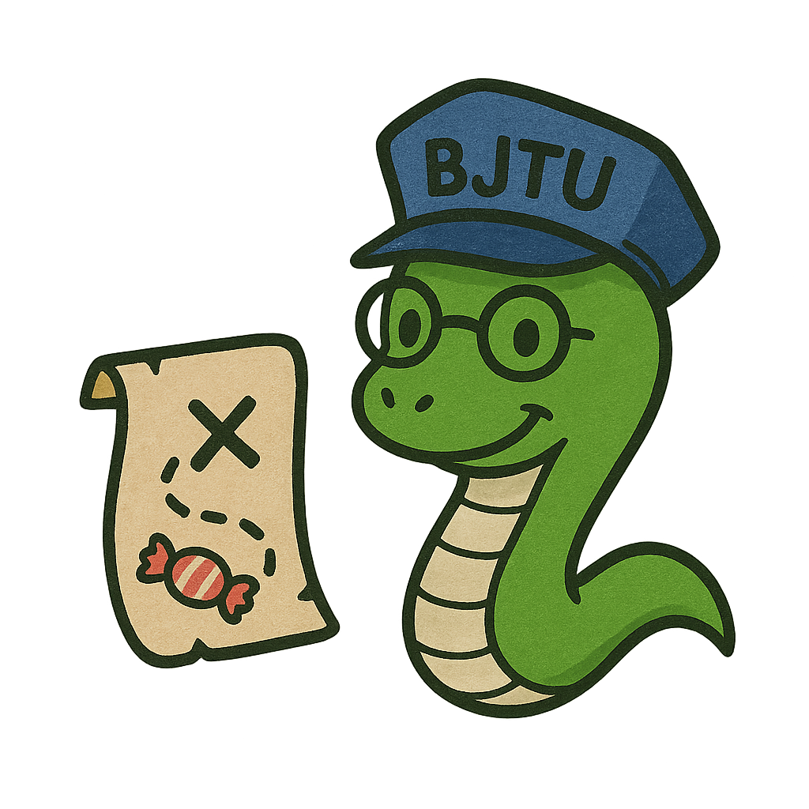

# 吃了吗 - 校园食堂点餐应用



## 项目介绍

"吃了吗"是一个轻量级校园食堂菜品展示和搜索应用，帮助学生快速查找校园内各个食堂的菜品、价格和位置信息。应用包含早餐、午餐、晚餐三个时段的菜品展示，支持菜品搜索功能，并提供食堂菜品盲盒功能，解决"今天吃什么"的难题。

## 功能特点

- **食堂选择**：可切换不同食堂查看菜品
- **餐次分类**：分为早餐、午餐、晚餐三个时段
- **智能推荐**：每个餐次展示推荐菜品
- **菜品搜索**：支持实时搜索菜品
- **盲盒功能**：随机推荐菜品，解决选择困难
- **个人中心**：查看账户余额、订单等信息

## 技术栈

- HTML5
- CSS3
- JavaScript (ES6+)
- 原生JS模块化开发

## 项目结构

```
eat-something/
│
├── css/               # CSS样式文件
│   └── style.css      # 搜索结果和弹窗样式
│
├── images/            # 图片资源目录
│   ├── 炒面.png
│   ├── 葱油饼.png
│   └── ...            # 其他菜品图片
│
├── js/                # JavaScript文件
│   ├── app.js         # 应用主逻辑
│   ├── data.js        # 菜品数据模块
│   ├── main.js        # 全局函数和初始化
│   └── restaurant.js  # 餐厅和菜品展示功能
│
├── index.html         # 主页面
├── styles.css         # 主样式表
├── .gitignore         # Git忽略配置
└── LICENSE            # MIT许可证
```

## 如何使用

1. 克隆仓库到本地
2. 使用浏览器直接打开index.html或通过本地服务器运行
3. 在顶部选择不同的食堂
4. 点击标签页切换早餐、午餐或晚餐
5. 使用搜索框查找特定菜品
6. 点击底部导航切换到盲盒页面，随机抽取菜品

## 盲盒功能

盲盒功能可以帮助解决"今天吃什么"的难题：

1. 选择食堂（可选择"全部食堂"）
2. 选择餐别（早餐、午餐、晚餐）
3. 点击"抽取盲盒"按钮
4. 获得随机推荐的菜品，包含菜品名称、价格和档口位置

## 开发者说明

数据模型结构:

```javascript
const restaurantData = {
  "食堂名称": {
    breakfast/lunch/dinner: {
      recommend: [
        { name: "菜品名", price: 价格, location: "档口位置", star: 评分 }
      ],
      all: [
        { name: "菜品名", price: 价格, location: "档口位置" }
      ]
    }
  }
}
```

## 许可证

本项目采用MIT许可证。详情请查看[LICENSE](LICENSE)文件。
